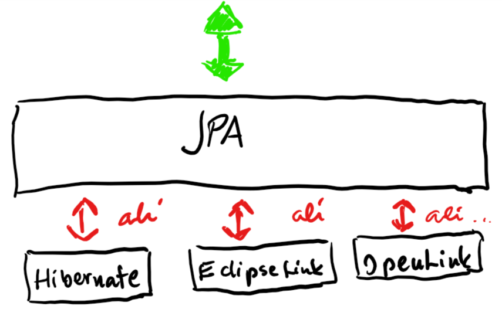
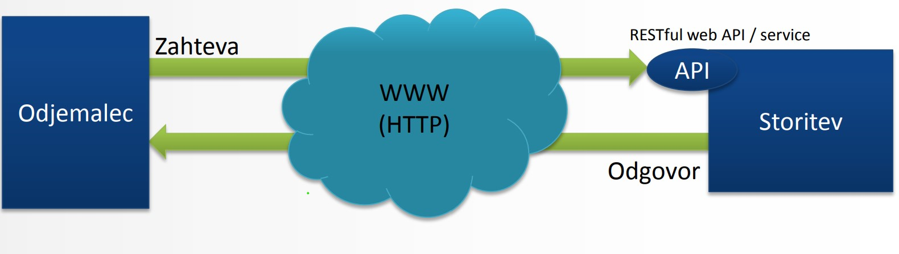
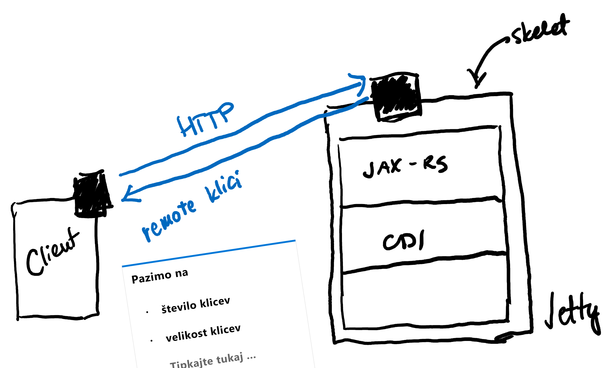

# Kazalo vsebine
- [Kazalo vsebine](#kazalo-vsebine)
- [Opravljanje predmeta](#opravljanje-predmeta)
- [Razvoj IT arhitektur](#razvoj-it-arhitektur)
  - [IT agilnost podjetji](#it-agilnost-podjetji)
  - [IT arhitektura](#it-arhitektura)
    - [Software platforma](#software-platforma)
    - [Namestitev aplikacije](#namestitev-aplikacije)
    - [Vrste SQL baz](#vrste-sql-baz)
      - [ACID baze](#acid-baze)
      - [BASE baze](#base-baze)
  - [Upravljanje z odvisnostmi](#upravljanje-z-odvisnostmi)
- [Maven](#maven)
  - [Prednosti uporabe Maven](#prednosti-uporabe-maven)
  - [POM - Project Object Model](#pom---project-object-model)
    - [Primer POM datoteke](#primer-pom-datoteke)
    - [Dedovanje POM datotek](#dedovanje-pom-datotek)
    - [Agregacija modulov](#agregacija-modulov)
  - [Maven življenjski cikli](#maven-%c5%beivljenjski-cikli)
  - [Struktura Maven projekta](#struktura-maven-projekta)
  - [Prakse pri uporabi Maven](#prakse-pri-uporabi-maven)
    - [Slaba praksa: podvajanje odvisnosti](#slaba-praksa-podvajanje-odvisnosti)
    - [DObra praksa: uporaba binarnega repozitorija](#dobra-praksa-uporaba-binarnega-repozitorija)
  - [Izdelava dokumentacije](#izdelava-dokumentacije)
- [JDBC - Java Database Connectivity](#jdbc---java-database-connectivity)
  - [Tipi JDBC gonilnikov](#tipi-jdbc-gonilnikov)
    - [Tip 1: JDBC-ODBC most](#tip-1-jdbc-odbc-most)
    - [Tip 2: delni javanski gonilnik](#tip-2-delni-javanski-gonilnik)
    - [Tip 3: javanski/mrežni gonilnik](#tip-3-javanskimre%c5%beni-gonilnik)
    - [Tip 4: čisti javanski gonilnik](#tip-4-%c4%8disti-javanski-gonilnik)
  - [Koraki pri uporabi JDBC](#koraki-pri-uporabi-jdbc)
    - [Korak 1: Nalaganje gonilnika](#korak-1-nalaganje-gonilnika)
    - [Korak 2: Sestavljenje URL niza za povezavo na bazo](#korak-2-sestavljenje-url-niza-za-povezavo-na-bazo)
    - [Korak 3: Vzpostavljanje povezave](#korak-3-vzpostavljanje-povezave)
    - [Korak 4: Kreiranje objekta ```Statement```, ```PreparedStatement``` ali ```CallableStatement```](#korak-4-kreiranje-objekta-statement-preparedstatement-ali-callablestatement)
      - [`Statement`](#statement)
      - [`PreparedStatement`](#preparedstatement)
      - [`CallableStatement`](#callablestatement)
    - [Korak 5: Izvršitev SQL povpraševanj ali shranjenih procedur](#korak-5-izvr%c5%a1itev-sql-povpra%c5%a1evanj-ali-shranjenih-procedur)
      - [Uporaba objekta `Statement`](#uporaba-objekta-statement)
      - [Uporaba objekta `PreparedStatement`](#uporaba-objekta-preparedstatement)
    - [Korak 6: Obdelava rezultatov](#korak-6-obdelava-rezultatov)
    - [Korak 7: Zapiranje povezave](#korak-7-zapiranje-povezave)
  - [JDBC transakcije](#jdbc-transakcije)
  - [JDBC Connection Pool](#jdbc-connection-pool)
  - [Dobre prakse uporabe JDBC](#dobre-prakse-uporabe-jdbc)
  - [DAO (Data Access Object)](#dao-data-access-object)
    - [Vzorec DAO](#vzorec-dao)
    - [Naloge DAO](#naloge-dao)
    - [Generiranje baznega DAO](#generiranje-baznega-dao)
- [Java Persistence API (JPA)](#java-persistence-api-jpa)
  - [Objektno-relacijska preslikava (ORM)](#objektno-relacijska-preslikava-orm)
  - [Primerjava arhitekture Java apliakcije](#primerjava-arhitekture-java-apliakcije)
  - [Struktura Java Persistence APIja (`javax.persistence`)](#struktura-java-persistence-apija-javaxpersistence)
    - [Razred `Persistence`](#razred-persistence)
    - [Razred `EntityManagerFactory`](#razred-entitymanagerfactory)
    - [Razred `EntityManager`](#razred-entitymanager)
    - [`Entity`](#entity)
    - [Razred `EntityTransaction`](#razred-entitytransaction)
    - [Vmesnik `Query`](#vmesnik-query)
      - [Java Persistence Query Language (JPQL)](#java-persistence-query-language-jpql)
  - [Anotiranje entitetnih razredov](#anotiranje-entitetnih-razredov)
  - [Relacije med entitetami](#relacije-med-entitetami)
  - [Dedovanje](#dedovanje)
  - [Osnovne operacije na entitetami](#osnovne-operacije-na-entitetami)
    - [Kreiranje entitetnih objektov](#kreiranje-entitetnih-objektov)
    - [Brisanje entitet](#brisanje-entitet)
    - [Posodabljanje entitet](#posodabljanje-entitet)
    - [Povpraševanje po entitetah](#povpra%c5%a1evanje-po-entitetah)
      - [Iskanje entitet](#iskanje-entitet)
      - [Povpraševanje po entitetah `QueryAPI`](#povpra%c5%a1evanje-po-entitetah-queryapi)
  - [Struktura Java Persistence APIja](#struktura-java-persistence-apija)
  - [Primerjava pristopov k shranjevanju podatkov v Javi](#primerjava-pristopov-k-shranjevanju-podatkov-v-javi)
- [Contexts and Dependency Injection (CDI)](#contexts-and-dependency-injection-cdi)
  - [CDI zrna](#cdi-zrna)
  - [Doseg CDI](#doseg-cdi)
  - [Prestrezniki (Interceptors)](#prestrezniki-interceptors)
- [Medklici](#medklici)
  - [HTTP kode](#http-kode)
    - [Uporabne HTTP kode za uspešno procesiranje](#uporabne-http-kode-za-uspe%c5%a1no-procesiranje)
    - [Uporabne HTTP kode za napake](#uporabne-http-kode-za-napake)

# Opravljanje predmeta
* 50% projekt pri vajah
* 50% kolokviji/izpit
> ### Kolokviji
> v času predavanj (**oba** nad 50% + **povprečje** nad 50%)
>1. kolokvij: 18.11.2019
>2. kolokvij: 20.01.2020

> "*Več znate, več zaslužite*"
> Jurič

# Razvoj IT arhitektur


Vrste uporbniškega vmesnika:
*   CLI - uporabniški vmesnik v konzoli
*   GUI - grafični vmesnik, program moramo prej namestiti na končno napravo (Word,...), grafični elementi operacijskega elementa
*   Web - vmesnik se izvaja v browser-ju
    * Server side web development SSWD
        * na client se prenese (večinoma) čisti HTML
        * vsaka sprememba se mora ponovno prenesti s strežnika
    * Client side web development CSWD (SPA - single page application)
        * izvajanje na clientu (JS)

## IT agilnost podjetji
1.  **Doba centralnih računalnikov** 
    * batch/množične obdelave (pripis obresti 1x mesečno, plače 1x mesečno,...), velika količina podatkov 1x v *časovne obdobju*
    * OLTP online transakcije
2.  **Dvo-nivojska arhitektura** - strežnik odjemalec (*fat client* - na klientu je veliko podatkov, na strežniku samo podatki (baza))
3.  **Tro-nivojska arhitektura** (internet) - ločujemo front, backend in podatke
*   premik iz razmišljanja o enotni aplikaciji v aplikacijo kot sestavljeno iz različnih delov
4.  **SOA - server oriented application** - aplikacija je sestavljena iz množice storitev (aplikacijo sestavimo iz "sestavnih delov")
5.  **Mikrostoritve**
    * *Iz katerih sestavnih delov naj bo sestavljena aplikacija?*
        * Spletna trgovina 
    * Prednosti
        * večja preglednost izvorne kode
        * manjša možnost sesutja celotne aplikacije (bolj robustna)
        * hitrejša (boljša možnost optimizacije)
        * skalabilnost (poganjanje instanc posameznih komponent) - FE se ne skalira, v BE skaliramo podatke z uporabo NoSQL (SQL se ne skalirajo tako dobro zaradi *cap teorema*)
    * Slabosti
        * API - komunikacija med komponentami (ozko grlo)

## IT arhitektura
### Software platforma
Skupek strežnikov storitev, ki jih za poganjanje aplikacije potrebujemo:
*   web server
*   file server
*   database server (DBMS)
*   IAM - identity server (npr. OAuth2)

### Namestitev aplikacije
**Monolitna** namestitev - aplikacijo namestimo v končni sistem v enem kosu
**Mikrostoritvena** namestitev - vsako komponento posebej namestimo (*npr. z uporabo Dockerja*)

> *Űber*\
> Jurič

>### Java EE
>| vrsta | datoteke |
>|---|---|
>|Java SE | JAR |
>|Java EE *zdaj Jakarte EE* | WAR, EAR |


>### Skalabilnost
> 
> Skalabilnost nam pove kaj se bo zgodilo z odzivnim časom, ko povečujemo število aktivnih uporabnikov. Težimo k temu, da je skalabilnost sistema čim boljša.
> 
>#### Vertikalna skalabilnost
>Povečujemo strojne zmogljivosti aplikacije (CPU, RAM, network)
>#### Horizontalna skalabilnost
>Zmožnost poganjanja večih instanc posamezne komponente (potreno pravilno programiranje)

>### Cap teorem
> C - transakcijska konsistentnost podatkov\
> A - razpoložjivost podatkov v konsistentni obliki v vseh vozliščih\
> P - particijska enostavnost: enostavnost horizontalne skalabilnosti\
> izbereš lahko največ dve od treh\
> 

> *"Če zaradi tega vržete puško v koruzo in ne govorite z Metko, je dobro, da hodite na ta predavanja"*
> Jurič, 21.10.19

### Vrste SQL baz
#### ACID baze
**A**tomicity, **C**onsistency, **I**solation, **D**urability
(Atomarnost, Konsistentnos, Izolacija, )
Običajno SQL relacijske baze
#### BASE baze
Pomembnejša je razpoložljivost od razpoložjivosti

## Upravljanje z odvisnostmi
Uporabljamo za avtomatizacijo režije:
*   upravljanje z odvisnostmi
*   build cycle - priprava za namestitev aplikacije
Primeri: *Maven*, Gradle.
Project Object Model (POM)

> ## Okolje aplikacije
1.  **Razvojno okolje** (DEV)
2.  **Testno okolje** - testira QA
3.  **User testno okolje** - še eno testno okolje, testirajo končni uporabniki
4.  **Produkcijsko okolje** - okolje, kjer se izvaja aplikacija

# Maven
> ## Verzioniranje
> **a.b.c-okolje** *(npr. 1.0.0)*
> * *a* - major
> * *b* - minor
> * *c* - release
> * *okolje* - SNAPSHOT (testno okolje)

## Prednosti uporabe Maven
*   boljša vidnost in transparentnost razvojnega procesa
*   apliciranje splošno sprejetih dobrih praks (verzioniranje)
*   stndarizacija (enotna struktura projektov)
*   upravljanje z odvisnostmi
*   samodejno generiranje spletne strani in dokumentacije

## POM - Project Object Model
V datoteki **pom.xml** definiramo:
| lastnost | definicija |
|--|--|
|naziv projekta| `<name>` |
|verzija|`<version>`|
|odvisnosti|`<dependencies><dependency>`|
|cilji (goals)||
|vtičniki (plugins)||
|metapodatki||

*   V `pom.xml` datoteki so obvezni podatki `groupID`, `artifactId`, `version` in `modelVersion`.
*   Lahko uporabljamo koncept dedovanja
*   Vsak `pom.xml` deduje od super POM-a


### Primer POM datoteke
```xml
<?xml version="1.0" encoding="UTF-8"?>
<project xmlns="http://maven.apache.org/POM/4.0.0">
    <modelVersion>4.0.0</modelVersion>
    <groupId>com.demo</groupId>
    <artifactId>projektA</artifactId>

    <!-- privzeto jar (izpuščamo), ostale: war, ejb, rar, ear, pom, custom-->
    <packaging>war</packaging>
    <version>0.0.1-SNAPSHOT</version>

    <dependencies>
        <dependency>
            <groupId>junit</groupId>
            <artifactId>junit </artifactId>
            <version>4.8.1</version>
            <scope>test</scope>
        </dependency>
    </dependencies>
</project>
```
*Ustvari artefakt `projektA-0.0.1-SNAPSHOT.war`*

### Dedovanje POM datotek

*Projekti B, C, D dedujejo verzijo, groupId, način pakiranja in vse druge odvisnosti in konfiguracijo vtičnikov, če nimajo sami drugače definirano.*

### Agregacija modulov

*Vsi ukazi nad A se izvdejo tudi nad B, C in D.*

## Maven življenjski cikli
*   **default** - namenjen korakom buildanja in nameščanja, najpomembnejši cilji (izvedejo se tudi vse predhodne faze):
    *   validate
    *   compile (.jar file iz artifactID in verzije)
    *   package - naredil compile in sestavi jar file
*   **clean** - čiščenje za seboj (predhodne builde)
    *   pre-clean
    *   clean
    *   post-clean
*   **site** (oblikovanje dokumentacije)
    *   pre-site
    *   site
    *   post-site
    *   site-deploy

Building iz komandne vrstice:
```cpp
    mvn clean
    //--

    // dobimo .class file
    mvn compile
    //--

    // compile & .jar file
    mvn package
    //--

    mvn run

    //kombinacija dveh ciljev
    mvn cleane package
```

## Struktura Maven projekta


## Prakse pri uporabi Maven
### Slaba praksa: podvajanje odvisnosti
Podvajanje odvisnosti za vsak projekt (*npr. kopiranje v mapo lib*).
### DObra praksa: uporaba binarnega repozitorija
**Repozitorij** je skupna lokacija za vse odvisnosti projektov, prednosti:
*   obstaja samo ena kopija
*   odvisnosti so shranjene izven projekta
*   odvisnosti so definirane v `pom.xml`
Privzeti oddaljen repozitorij je **maven control** (*repo1.maven.org*), uporabljamo lahko tudi druge. **Organizacijski repozitorij** hrani vse artefakte, ki izboljšujejo varnost in hitrost. **Lokalni repozitorij** predstavlja predpomnilnik za artefakte iz oddaljenih repozitorijev.

## Izdelava dokumentacije
Spletno stran z dokumentacijo generiramo z uporabo ukaza `mvn site`, spletne strani se nahajajo v mapi `target/site`.

# JDBC - Java Database Connectivity

Standardna javanska knjižnica JDBC API standarizira:
*   vzpostavljanje povezave na bazo
*   izvajanje SQL povpraševanj
*   strukturo rezultatov povpraševanj

JDBC sestavljajo:
*   JDBC API - čisti javanski API
*   JDBC Driver Managerm ki komunicira s produktno-specifinimi gonilniki, ki opravijo dejansko komunikacijo s podatkovno bazo


## Tipi JDBC gonilnikov
### Tip 1: JDBC-ODBC most
Vsi JDBC klici se pretvorijo v ODBC klice in jih kot take posredujejo ODBC gonilniku, ki je generičen API za dostop do baze. Zaradi slabe prenosljivosti in slabega performansa je primerna samo za testne namene ali kadar ni na voljo javanskega gonilnika.


### Tip 2: delni javanski gonilnik
JDBC klic se posreduje specifičnemu gonilniku za posamezen tip podatkovne baze, vendar ni napisan v Javi, zaradi česar je v praksi redko uporabljen.


### Tip 3: javanski/mrežni gonilnik
Najbolj učinkovit gonilnik, vse zahteve se preko mreže posredujejo do vmesnega sloja, ki nato ustrezno pretvori ukaze (uporaba nekega drugega tipa gonilnika). Zahteva vzdrževanje gonilnikov na strani strežnika.


### Tip 4: čisti javanski gonilnik
Omogoča komunikacijo direktno s podatkovno bazo, JAR datoteko dodamo v classpath. Omogoča visoko prenosljivost in neodvisnost ter dober performanse, vendar za vsak tip baze potrebujemo drug gonilnik.


Pošiljanje SQL stavkov podatkovni bazi:
*   **Statement** - pošilja navaden SQL, ni dobra praksa, ker je navaden String
*   **Prepared statement** - pošilja navaden SQL, predpošiljanje, lahko si PB pripravi način izvajanja, chekira za vdore
*   **Callable statement** - PL/SQL (ni dobra praksa)

## Koraki pri uporabi JDBC
### Korak 1: Nalaganje gonilnika
*Od Jave 6 ni več potreben, naloži se na podlagi JDBC URL niza.*

### Korak 2: Sestavljenje URL niza za povezavo na bazo
**Format**: `jdbc:vendorName://host:port/databaseName`
```java
String host = "jakmar.cloud.si";
String dbName = "jakaStorage";
int port = 8080;
String db2Url = "jdbc:db2://"+host+":"+port+"/"+dbName;
```

### Korak 3: Vzpostavljanje povezave
Povezavo pridobimo s pomočjo razreda `DriverManager` s klicem njegove metode `getConnection()`.
```java
String userName = "jakmar17"
String password = "geslo123"
Connection con = DriverManager.getConnection(db2Url, username, password);
```

### Korak 4: Kreiranje objekta ```Statement```, ```PreparedStatement``` ali ```CallableStatement```

#### `Statement`
Omogoča izvedbo SQL stavka, ki ga sestavimo kot navaden String. Ne omogoča uporabe parametrov.

#### `PreparedStatement`
SQL povpraševanje sestavimo v obliki niza, ki omogoča uporabo parametrov. Parameter označimo kot `?`, ki ga nato ustavimo kot `setXXX(indeks, vrednost)` (*npr `setInt(1, 3)*). Preprečuje SQL injection in je predhodno preveden - zagotavlja boljši performanse.

#### `CallableStatement`
Omogoča klic shranjenih procedur.

### Korak 5: Izvršitev SQL povpraševanj ali shranjenih procedur
#### Uporaba objekta `Statement`
```java
public void vrniUporabnika (int id) {
    Statement s = null;
    try {
        s = conn.createStatement();
        String sql = "select * from uporabniki where id_uporabnika = " +id;
        ResultSet rs = s.executeQuery(sql);

        //obdelava rezultatov
        if (rs.next()) {
            String ime = rs.getString("ime");
        //nadaljna obdelava rezultatov
        } else {
            System.out.println("Ne najdem uporabnika");
        }
    } catch (SQLException e) {
        System.out.println(e.printStackTrace());
    } finally {
        if (s != null)
            s.close();
    }
}
```

Nad objektom tipa Statement vršimo eno izmed operacij:
|Operacija||
|---|---|
|`ResultSet executeQuery(String sql)`|vrne tabelo rezultatov tipa `ResultSet`|
|`boolean execute(String SQL)`|vrne `true`, če lahko pridobimo `ResultSet`|
|`int executeUpdate(String SQL)`|vrne število spremenjenih/dodanih/izbrisani vrstic|

#### Uporaba objekta `PreparedStatement`

```java
public void vrniUporabnika(int id) {
    PreparedStatement ps = null;
    try {
        String sql = "select * from uporabniki where id_uporabnika = ?";
        ps = conn.preparedStatement(sql);
        ps.setInt(1, id);
        ResultSet rs = ps.executeQuery();

        //obdelava rezultatov
        if(rs.next()) {
            String ime = rs.getString("ime");

            //nadaljna obdelava
        } else {
            // uporabnika ne najde
        }
    } catch (SQLException e) {
        System.out.println(e.printStackTrace());
    } finally {
        if (ps != null)
            ps.close();
    }
}
```

### Korak 6: Obdelava rezultatov
Če ne poznamo strukture tabele, jo pridobimo s klicem metode ```getMetaData()```.
```java
ResultSet rs = ps.executeQuery();
while(rs.next()){
    String ime = rs.getString(“ime”);
    String priimek = rs.getString(“priimek”);
    int starost = rs.getInt(“starost”);
    System.out.println(“ime: ”+ime+” priimek: “+priimek+”
    starost: ”+starost);
}
```
Privzeto se lahko v `ResultSet` premikamo samo naprej, lahko pa definiramo scrollable `ResultSet`:
```java
Statement s = con.createStatement (
                ResultSet.TYPE_SCROLL_INSENSITIVE,
                ResultSet.CONCUR_UPDATABLE
            );
ResultSet rs = s.executeQuery("select * from table");
```

### Korak 7: Zapiranje povezave
```java
try {
    if (conn != null)
        conn.close();
} catch(SQLException e) {
    e.printStackTrace();
}
```

> *"Imate prijaznega asistenta letos.... šalim se malo"*\
> Jurič, 21.10.19

## JDBC transakcije
Privzeto se vsi ukazi samodejno potrdijo, torej `autoCommit = true`

Če želimo več ukazov izvesti kot eno transakcijo:
```java
Connection conn = DriverManager.getConnection(url, user, pass);
connection.setAutoCommit(false);

try {
    statement.executeUpdate(...);
    statement.executeUpdate(...);
    statement.executeUpdate(...);
    ...

    conn.commit();
} catch (SQLException e) {

} finally {
    try {
        if (conn != null)
            conn.close();
    } catch (Exception e) {

    }
}
```

## JDBC Connection Pool

Možnosti povezave na podatkovno bazo:
1.  Vsaka mikrostoritev ima svojo povezavo (slaba izkoriščenost povezav)
2.  Koncept bazen povezav - določeno število v naprej prirpavljenih povezav na PB. Vsaka storitev se poveže na connection pool. Storitev ima občutek, da ima svojo povezavo, v resnici bazen sproti določa povezavo, glede na potrebo storitve.


*Connection Pool == **DataSource*** kje se nahaja programerja ne zanima (mikro storitev, PB...)
**JNDI** = Java Naming and Directory Interface, abstrakcija LDAP-ja

Primer uporabe JNDI-ja
```java
public Connection povezi() throws SQLException {
    Connection con = null;

    try{
        Context initCtx = new InitialContext();
        Context envCtx = (Context) initCtx.lookup("java:comp/env");

        DataSource ds = (DataSource)envCtx.lookup("jdbc/TestDB");
        con = ds.getConnection();
    } catch (NamingException e) {

    }

    return con;
}
```

> *"Pasvord"*\
> Jurič

> *"Kolegice in kolegi"*\
> Jurič

**RDBS**
**TPM**

## Dobre prakse uporabe JDBC
*   Ne-mešanje poslovne logike in JDBC

Ne delaj tega
```java
public boolean preveriStanjeUp (...) {
    //JDBC koda
    ...
    //

    //poslovna logika
    ...
    //
}
```

Delaj tako:
```java
public boolean preveriStanjeUp (...) {
    //posebej narediš DAO (DataAccessObject)
    getStatus(...);

    //naprej pišemo poslovno logiko
    ...
}
```

*   uporaba transakcij
*   uporaba `PreparedStatement` ne `Statement`

## DAO (Data Access Object)
Standardni javanski načrtovalski vzorec, ki predvideva ločitev nizko-nivojskih operacij za dostop do podatkov od visoko-nivojske poslovne logike. DAO skriva kompleksnost in izpostavlja vmesnik, ki ga uporablja poslovni nivo.
Dao se uporablja v kombinaciji z **objekti za prenos podatkov DTO** (Data Transfer Object).

V DAO imamo tudi ```getUporabnik()```, kjer dobimo "pravega uporabnika". Za ta namen uporabimo ```Java Zrno (Java Bean)``` s prilagojenimi ```get``` in ```set``` metodami. Takšnemu zrnu pravimo ```DTO (Data Transfer Object)```.

Zakaj?
*   razdelimo odgovornost
*   lahko spreminjamo podatkovno bazo brez spreminjanja poslovne logike

### Vzorec DAO


### Naloge DAO
*   transakcije
*   obravnava napak
*   beleženje (logiranje)

### Generiranje baznega DAO
```java
public interface BaseDao {

}
```

> ## Serializacija
> > V eni JVM se objekti pošiljajo kot *pass-by-reference*
> Avomatski postopek pretvarjanja iz stanja objekta v tok podatkov za pošiljanje objekta med različnimi JVM v omrežju. Obstajata dve vrsti serializacije:
> *   binarna serializacija (podpira npr. ciklične grafe)
> *   markup serializacija (JSON ali ??) - pretvarjanje direktno iz in v objekte (podpira zgolj hierarhične podatkovne modele)
> 
> ```java
> 
> public Razred seriazibilen implements Serializable  {
> 
> }
> 
> ```

# Java Persistence API (JPA)
Namesto, da za vsak objekt napišemo DAO in DTO, ali lahko napišemo samo DTO?\


Za to poskrbi **Objektno-relacijski preslikovalniki (ORM)**, ki obstajajo v večini programskih jeziki. Najbolj poznano je *Hibernate*, v Javi se programski vmesnik imenuje **JPA - Java Persistence Application**.

JPA je Javansko ogrodje za upravljanje relacijskih podatkov spodporo tradicionalnim O-O modelirnim konceptom (dedovanje, polimorfizem, enkapsulacija). JPA je specifikacija zahtev, ki jih morajo implementacije upoštevati, vendar ne ponuja (sama po sebi) nobenih funkcionalnosti.




## Objektno-relacijska preslikava (ORM)
Objektno-relacijska preslikava je tehnika za premoščanje razkoraka med objektnim in relacijskim svetom. Namesto ročnega preslikovanja vpeljemo mediatorja, ki to opravlja avtomatsko. Pogoji takšne preslikave so:
*   **objekti, ne tabele** - povpraševanje je omogočeno z objekti (brez relacijskega jezika), aplikacije so napisane v objektnem modelu
*   **prepričljivost, ne ignoranca** - orodja za preslikavo niso namenjene skrivanju problemov preslikave
*   **nevsiljiv, ne prosojen** - ne pričakujemo popolne prosojnosti modela, vendar preslikava ne vpliva na objektni model aplikacije
*   **obstoječi podatki, novi objekti** - omogočena je uporaba že obstoječih baz (bolj verjetno kot kreiranje nove)
*   **dovolj, a ne preveč** - pretornik ne vsebuje velike količine nepotrebnih funkcionalnosti, ki rešujejo probleme, ki to niso
*   **lokalno, a mobilno**

## Primerjava arhitekture Java apliakcije


## Struktura Java Persistence APIja (`javax.persistence`)


### Razred `Persistence`
Vsebuje statične pomožne metode za pridobitev instance `EntityManagerFactory` razreda

### Razred `EntityManagerFactory`
tovarna za EntityManager-je

### Razred `EntityManager`
Primarni JPA vmesni, ki ga uporabljajo aplikacije. Vsaka instanca upravlja nabor trajnih objektov. Kadar ga uporabljamo izven vsebnika, je povezan natančno z eno transakcijo.

Je ključni vmesni v JPA, omogoča izvajanje **CRUD** (create, read, update, delete) operacij:
|ime metode|zagotavlja|
|---|---|
|`persist()`|kreiranje objektov|
|`find()`|pridobivanje objektov|
|`merge()`|posodabljanje objektov|
|`remove()`|brisanje objektov|

Ter zagotavlja dostop do povprašvelnega mehanizma: `createQuery()` in `createNamedQuery()`

### `Entity`
So trajni objekti, ki predstavljajo zapise v podatkovni bazi. V osnovi je entiteta preprost javanski razred z oznako `@Entity` ali ustrezno definicijo v XML deskriptorju.

### Razred `EntityTransaction`
Omogoča grupiranje operacij nad trajnimi objekti v enote dela, ki se lahko v celoti uspešno zaključijo ali ne uspejo in ohranijo prejšnje stanje podatkovne baze.

### Vmesnik `Query`
Za iskanje trajnih objektov, ki ustrezajo iskalnim kriterijem. JPA standarizira podporo iskanju z uporabo tako Java Persistence Query Language (JPGL) kot SQL.

#### Java Persistence Query Language (JPQL)
Objektno orinetirani poizvedovalni jezik (nadomestek SQL). Ima poimenovane (`:named`) ali pozicionirane (`?1`) parametre.

## Anotiranje entitetnih razredov

```@Table``` spreminja privzeto ime tabele (drugače uporabimo ime razreda)\
```@Column``` spreminja privzeto ime stolpca (drugače uporabimo ime spremenljivke)

```java
@Entity
@Table(name = "imeTabele")
public class Oseba {
    @Column(name = "idOsebe", length = 10)
    private String id;

    @Column(name = "davcnaStevilka", length = 9)
    private String davcnaStevilka;
}
```

```@SecondaryTable``` omogoča urejanje podatkov po več tabelah.

```java

@Entity
@SecondaryTables({
    @SecondaryTable (name = "naslov")
})
public class Oseba {
    @Column(name = "idOsebe", length = 10)
    private String id;

    @Column(name = "naslov")
    private String naslov;

    @Column(name = "kraj")
    private String kraj;
}
```

```@Id``` označuje atribut, ki definira primarni ključ. `@GeneratedValue` določa strategijo za določanje primarnega ključa pri kreiranju nove entitete (`SEQUENCE`, `IDENTITY`, `TABLE`, `AUTO`).

```java
@Entity
public class Oseba {
    @Id
    @GeneratedValue(strategy = GeneratedType.AUTO)
    private String id;
}
```

```@Temporal``` določa obliko za shranjevanje datuma ali časa (`DATE`, `TIME`, `TIMESTAMP`)

```java
@Entity
public class Oseba {
    @Id
    private String id;
    
    @Temporal(TemporalType.DATE)
    private Date datumRojstva;

    @Temporal(TemporalType.TIMESTAMP)
    private Date zadnjaAktivnost;
}
```

```@Trannsient``` spremenljivka, ki je nočemo, da je shranjena v podatkovni bazi.

```java
@Entity
public class Oseba {
    @Id
    private String id;

    @Transient
    private String sejniKljuc;

    private String ime;
    private String priimek;
}
```

```@Enumerated``` za uporabo naštevnih tipov (`emun`), ki so nabor konstant

```java
@Entity
public class Oseba {
    @Id
    private String id;

    @Emurated(EnumType.STRING)
    private TipOsebe tipOsebe

    private enum TipOsebe {
        FIZICNA, PRAVNA;
    }
}
```

```@ElementCollection``` in ```@CollectionTable``` definira način pridobitve seznama primitivnih tipov

```java

@Entity
public class Oseba {
    @Id
    private String id;
    private String ime;
    private String priimek;
    @ElementCollenction (fetch = FetchType.LAZY) //LAZY ali EAGER
    @CollectionTable (name = "Zaznamek")
    @Column (name = "vrednost")
    private ArrayList <String> zaznamki;
}

```

## Relacije med entitetami

|Relacija|Pomen|
|**One-to-one**|vsaka instanca prve entitete je povezana z natanko eno instanco druge entitete|
|**One-to-many**|vsaka instanca prve entitete je lahko povezana z večimi instancami druge entitete|
|**Many-to-one**|več instanc prve entitete je lahko povezanih z eno instanco druge entitete|
|**Many-to-many**|več instanc prve entitete je povezanih z večimi instancami druge entitete|

Vse relacije podpirajo atribut s katerim določimo kdaj se bo vsebovani objekt naložil: **takojšnje `eager`** (elementi se naložijo tako ob nalaganju prvega) je privzet za `OneToOne` in `ManyToOne`, **odloženo `lazy`** (elementi se naložijo ob klicu nanj) je privzeta strategija pri `OneToMany` in `ManyToMany`

```Java
@Entity
public class Oseba {

    @Id
    @GeneratedValue(strategy = GenerationType.AUTO)
    private String id;

    @OneToMany(fetch = FetchType.EAGER)
    private Naslov naslov;
}
```

## Dedovanje
Koncept dedovanja ni poznan v relacijskem modelu, zato JPA definira 3 različne strategije preslikave hierarhičnega (objektnega modela z dedovanjem) v relacijskega:
*   **strategija enojne tabele**
    *   atributi celotne hierhije so sploščeni v eno tabelo
    *   privzeta strategija dedovanja
    *   dodani stolpec **diskriminator** določa tip posamezne vrstice
    *   neizkoriščen prostor
*   **strategija pridružitve**
    *   vsaka entiteta v hierhiji je preslikana v svojo tabelo
    *   korenska entiteta določa primarni ključ, ki je uporabljen v vseh drugih
    *   najbolj odraža objektni model, vendar je zmogljivost povpraševanja slabša zaradi večjega števila tabel
*   **strategija tabela na konkreten razred**
    *   vsak konkreten razred ima svojo tabelo
    *   vsi atributi korenskega razreda se preslikajo v stoplce tabele podrazreda
    *   vse tabele imajo skupen primarni ključ
    *   denormaliziran podatkovni model
    *   relativno dobro povpraševanje, slaba zmogljivost polimorfičnega povpraševanja (`UNION`)

## Osnovne operacije na entitetami
### Kreiranje entitetnih objektov
Entitetni objekti so navadni javanski objekti, dokler jih ne upravljamo in trajno shranjujemo s pomočjo upravljalca entitet, ki ga kličemo z uporabo metode `persist()`.

### Brisanje entitet
Metoda `remove()` z argumentom objekta, ki je upravljana entiteta, odstrani entiteto iz podatkovne baze (ali pa jo samo označi kot odstranjeno, dejansko brisanje pa se izvede ob klicu `flush()`). Ob klicu metode je objekt ločen od trajnega konteksta in ni več upravljan s strani upravljalca entitet.

```java
em.getTransaction().begin();
Oseba o = em.find(Oseba.class, "151");
em.remove(o);
em.flush();
em.getTransaction().commit();
```

### Posodabljanje entitet
Metoda `merge()`:
```java
em.getTransaction().begin();
Oseba o = em.find(Oseba.class, "151");
o.setIme("Martin");
em.merge(o);
em.flush();
em.getTransaction().commit();
```

### Povpraševanje po entitetah
#### Iskanje entitet
|`find()`|`getReference()`|
|---|---|
|`Oseba o = em.find(Oseba.class, "12");`|`Oseba o = em.getReference(Oseba.class, "12");`|
|če upravljalec entitet ne najde ustrezne entitete vrača `null`|če upravljalec ne najde ustrezne entitete vrača `EntityNotFoundException`|
||omogoča leno nalaganje (lazy loading)

#### Povpraševanje po entitetah `QueryAPI`

**Dinamična povpraševanja** so manj zmogljiva, saj se med izvajanjem ustvari nov objekt `Query`
```java
Query q = em.createQuery("SELECT o FROM Oseba o WHERE o.ime = 'Mihi'");
List<Oseba> osebe = (List<Oseba>)(q.getResultList());
```

Lahko definiramo tudi **statična povpraševanja** nad entitetnim razredom:
```java
@Entity
@NamedQueries({
    @NamedQuery(name = "izberiVseOsebe",
                query = "SELECT o FROM Osebe o"),
    @NamedQuery(name = "izbrisiVseOsebe",
                query = "DELETE FROM Oseba")
})
public class Oseba{
    ...
}
```
Statična povpraševanja kličemo z:
```java
Query q = em.createNamedQuery("izberiVseOsebe");
List<Oseba> osebe = (List<Oseba>)(q.getResultList());
```

Povpraševanje lahko vrača samo en rezultat
```java
Query q = em.createQuery("SELECT o FROM Oseba o WHERE o.id = '654'");
Oseba o = (Oseba) q.getSingleResult();
```

V povpraševanjih lahko uporabimo parametre:
```java
Query q = em.createQuery("SELECT o FROM Oseba o WHERE o.ime = ?1");
q.setParameter(1, "Mihi");

q = em.createQuery("SELECT o FROM Oseba o WHERE o.ime = :ime");
q.setParameter("ime", "Mihi");
```

Rezultate lahko ostranjujemo, če predvidevamo, da jih bo veliko:
```java
int stZapisov = 3;
int zacetek = 0;

for (;true;) {
    Query q = em.createQuery("SELECT o FROM Oseba o");
    
    q.setMaxResults(stZapisov);
    q.setFirstResult(zacetek);

    List<Oseba> osebe = q.getResultList();
    if(osebe.isEmpty())
        break;
    
    //obdelamo 1 stran rezultatov
    em.clear();
    zacetek += osebe.size();
}
```

## Struktura Java Persistence APIja


> *"Kolegice in kolegi, tako mimogrede"*
> **Design paterns**
> Najboljše rešitve nekih tipičnih problemov s katerimi se srečamo pri programiranju.
>
>Zbirka *design paternov* **GoF** - *Gang of Four*. [Mogoče ta](https://en.wikipedia.org/wiki/Gang_of_Four), [verjetno ta](https://en.wikipedia.org/wiki/Design_Patterns).

> **UML CLASS DIAGRAM**
>
> 
> spremenljivke in metode lahko izpustimo

## Primerjava pristopov k shranjevanju podatkov v Javi

|Podpora|Serializacija|JDBC|ORM|ODB|EJB 2|JDO|JPA|
|--|--|--|--|--|--|--|--|
|Java objekti|+||+|+|+|+|+|
|Napredni OO koncepti|+||+|+||+|+|
|Transakcijska integriteta||+|+|+|+|+|+|
|Hkratnost||+|+|+|+|+|+|
|Veliki nabori podatkov||+|+|+|+|+|+|
|Obstoječa shema||+|+||+|+|+|
|Relacijske in ne-relacijske shrambe|||||+|+||
|Povpraševanja||+|+|+|+|+|+|
|Standarizacija/prenosljivost|+||||+|+|+|
|Preprostost|+|+|+|+||+|+|

**Serializacija**
|Prednosti|Slabosti|
|--|--|
|vgrajeni mehanizmi za preoblikovanje objektov v zaporedje bitov|omejena|
|enostavna za uporabo|shranjuje in pridobiva celotne objekte, ne primerna za veliko količino podatkov|
||ne omogoča razveljavljanja sprememb|
||enonitno delovanje|
||ne omogoča povpraševanj|

**JDBC (Java Database Connectivity)**
|Prednosti|Slabosti|
|--|--|
|obvladuje večje količine podatkov|ni enostavna za uporabo|
|mehanizmi za zagotavljanje podatkovne integritete|ni načrtovan za shranjevanje objektov|
|podpira hkraten dostop do podatkov|vsiljuje opuščanje objektno orientiranega programiranja|
|povpraševalni jezik SQL||

**Objektno-relacijske preslikave (ORM)**
|Prednosti|Slabosti|
|--|--|
|neodvisni produkti izvajajjo preslikavo med objekti in relacijsko podatkovno bazo|vsak produkt ima svoj API||osredotočenje na objektni razvoj|aplikacija je tesno odvisna od ponudnika produkta|
||prehod na drugi produkt zahteva spremembe v kodi|

**Objektne podatkovne baze (ODB)**
|Prednosti|Slabosti|
|--|--|
|baze, načrtovane za shranjevanje objektov|nevarnost odvisnosti od ponudnika|
|enostavne za uporabo|nepoznana, nepreizkušena tehnologija|
||manj orodji za analizo|

**Enterprise Java Beans (EJB 2.0)**
|Prednosti|Slabosti|
|--|--|
|ni omejeno samo na relacijske podatkovne baze|omejena podpora za objektno-orientirane koncepte|
|uporablja stroge standarde (zato prenosljivo med ponudniki)|ne podpira dedovanja, polimorfizma, kompleksnih odvisnoti|
||težavni za programiranje|
||zahtevajo kompleksne (drage) aplikacijske strežnike|

**Java Data Objects (JDO)**
|Prednosti|Slabosti|
|--|--|
|specifikacija, podobna JPA|manj uveljavljena od JPA|
|podpora ne-relacijskim podatkovni bazam|ne-ralacijska podpora se oddaljuje od specifikacij|


**Java Persistence API (JPA)**

Združuje najboljše lastnosti omenjenih mehanizmov:
*   kreiranje entitet je preprosto
*   podpora za veliko količino podatkov
*   zagotavlja konsistenco podatkov
*   omgoča hkratno uporabo
*   ponuja povpraševalne sposobnosti JDBC-ja (SQL == JPQL)
*   omogoča uporabo objektnih konceptov
*   standardna specifikacija
*   osredotočena na relacijske podatkovne baze


# Contexts and Dependency Injection (CDI)
**CDI zagotavlja**
*   **Kontekst** *(context)* - komponente imajo določene življenjske cikle in interakcije glede na jasno definirane in razširljive kontekste
    
*   **Vstavljanje odvisnosti** *(dependency injection)* omogoča vstavljanje referenc na posamezne komponente znotraj aplikacije

CDI razvijalcem omogoča, da imajo njihovi objekti avtomatsko zagotovljene odvisnosti, namesto, da jih sami ustvarjajo ali dobijo kot parametre.

CDI omogoča tudi:
*   integracijo z *Expression Language (EL)* za uporabo Java server faces in Java server pages
*   možnost dodajanja dekoratorjev komponentam
*   dodajanje prestreznikov (interceptorjev)
*   uporabo dogodkov

## CDI zrna
So razredi, ki jih instancira, upravlja in vstavlje CDI vsebnik.

## Doseg CDI


## Prestrezniki (Interceptors)

Interceptor omogoča, da se pred ali po izvedbi neke metode izvede še nekaj drugega (npr. še 
ena metoda).
```java
@MojPrestreznik
public void nekaDrugaMetoda (int id) {
    //preden se izvede nekaDrugaMetoda se izvede metoda MojPrestreznik
}
```
```MojPrestreznik()``` je definiran v CDI zrnu.

### Tipi prestreznikov
Specifikacija definira tri tipe prestreznikov:
1. **Business method interceptor** zadevajo klice metod zrna s strani odjemalca zrna
    ```java
    public class TransactionalInterceptor {
        @AroundInvoke
        public Object manageTransaction(InvocationContext ctx) throws Exception {...}
    }
    ```
2.  **Lifecycle callback interceptor** se nanaša na povratne klice v življenjskem ciklu s strani vsebnika:
    ```java
    public class DependencyInjectionInterceptor {
        @PostConstruct
        public void injectDependencies(InvocationContext ctx) {...}
    }
    ```
3.  **Timeout method interceptor** se nanaša na klivce EJB timeout metod s strani vsebnika
    ```java
    public class TimeoutInterceptor {
        @AroundTimeout
        public Object manageTransaction(InvocationContext ctx) throws Exception {...}
    }
    ```

### Definicija novega prestreznika
1. Definiramo tip, kjer uporabnimo anotacijo `@InterceptorBinding`
    ```java
    @InterceptorBinding
    @Target({METHOD, TYPE})
    @Retention(RUNTIME)
    public @interface Transactional {}
    ```
2.  Določimo, da je razred transakcijski objekt ali pa je zgolj ena metoda transakcijska:
    ```java
    @Transactional
    public class ShoppingCart{...}

    /*ali*/

    public class ShoppingCart {
        @Transactional public void checkout() {...}
    }
    ```
3. Prestreznik še implementiramo z dodano anotacijo `@Interceptor`
    ```java
    @Transactional @Interceptor
    public class TransactionalInterceptor {
        @Resource UserTransaction transaction;
        @AroundInvoke
        public Object manageTransaction(InvocationContext ctx) throws Exception {...}
    }
    ```
4. Prestreznik omogočimo z `@Priority` ali v deskriptorju `beans.xml`:
    ```xml
    <beans ...>
        <interceptors>
            <class>org.mycompany.myapp.TransactionInterceptor</class>
        </interceptors>
    </beans>
    ```

## Uporaba JTA in transakcij
Z uporabo JTA (Java Transaction API) v CDI zrnih deklerativno upravljamo s transakcijami, transakcije upravljamo z anotacijo `javax.transaction.Transaction` na metodah. Kot parameter podamo transakcijski kontekst tipa `Transactional.TxType`.

Podprti tipi transakcijskih kontekstov znotraj `Transactional.TxType` so:
*   `MANDATORY` - če metodo kličemo izven transakcijskega konteksta, se proži `TransactionRequiredException`
*   `NEVER` - če metodo kličemo izven transakcijskega konteksta, se izvede izven transakcijskega konteksta
*   `REQUIRED` - če metodo kličemo izven transkacijskega konteksta, se odpre nov transakcijski kontekst v katerem se izvede metoda

```java
@Transactional(Transactional.TxType.REQUIRED)
public Payment processPayment() {
    ...
}
```

> *"Kaj bluzi Jurič"*\
> Jurič, 4.11.2019

## CRUD ukazi
**C** - create, **R** - read, **U** - update, **D** - delete ukazi

# Loggiranje v Javi

## Knjižnice, ki podpirajo loggiranje
*   JUL (Java Util Logger) - že vključena
*   LOG4J 1 in 2
*   SLF4J

> *Pol so prišli malo boljši časi, manj stari časi.*
> Jurišič, 11.11

# Representational State Transfer (REST)
**REST** je arhitekturni stil, ki izvaja abstrakcijo arhitekturnih elementov znotraj distribuiranih hipermedijskih sistemov (odjemalec-strežnik). Je brez stanja z močno uporabo medpomnenja.

Ključne lastnosti REST-a so: skalabilnost, splošnost, neodvisnost, odzivnost na spremembe, latenca, varnost in enkapsulacija.

**HATEOAS** (Hypermedia as the engine of application state) je dodatna omejitev REST arhitekture, ki definira naj odjemalec komunicira z aplikacijo preko omrežja zgolj preko hipermedija, ki ga dinamično streže strežnik. Kot posledica REST odjemalec vstopa preko znane vstopne točke v sistem.

## Zgodovinski razvoj vmesnikov
*   binarni
    *   RPC
    *   CORBA
    *   RMI
*   text
    *   SOAP (XML), opišemo z WSDL
    *   REST (JSON, XML, ali katerikoli MIME), opis ni potreben (ponavadi Swegen/Open API)
*   gRPC (spet binarni)


## Oblikovanje RESTful storitev
**RESTful spletni API** ali **RESTful spletna storitev** deluje na osnovi REST arhitekture in HTTP protokola.

REST storitve gradijo spletni API, ki je razumljiv razvijalcu izven okolja razvoja storitve. Uporaben je preko naslove vrstice brskalnika, zato je preprost, intuitiven in konsistenten, vendar hkratu tudi razširljiv in efektiven.



## Viri API storitve
Vire oblikujemo enostavno in učinkovito, po strategiji **grobo zrnato, samostalniki v množini**.

|Vir zbirke|Vir instance|
|--|--|
|/razmerja|/razmerja/2234|

## Akcije
Uporabljajo se standardne HTTP metode
|HTTP metoda|pomen|
|--|--|
|`GET`|metoda pridobiva podatke iz strani strežnika (branje)|
|`POST`|ustvarjanje novega vira|
|`PUT`|posodabljanje celotnega obstoječega vira|
|`DELETE`|brisanje vira|
|`HEAD`|branje HTTP zaglavja brez vsebine|
|`PATCH`|delno posodabljanje obstoječega vira|

Primeri poizvedb:

|HTTP metoda|URL||
|--|:--:|--|
|```GET```|```/razmerje```|pridobi seznam razmerij|
|```GET```|```/razmerje/345```|pridobi razmerje z *DI 345*|
|```POST```|```/razmerje```|ustvari novo razmerje|
|```PUT```|```/razmerje/345```|posodobi razmerje z *ID 345*|
|```DELETE```|```/razmerje/345```|izbriše razmerje z *ID 345*|

### `GET`
*   za branje celotnega vira:
    ```HTTP
    GET /razmerja
    ```
    odgovor s HTTP kodo 200:
    ```JSON
    200 OK
    [
        {
            "id": 12345,
            "naziv": "Razmerje1",
            ...
        }, 
        {
            "id": 12344,
            "naziv": "Razmerje2",
            ...
        },
        ...
    ]
    ```
*   za branje specifičnega vira
    ```HTTP
    GET /razmerje/12345
    ```
    odgovor z HTTP kodo 200
    ```JSON
    200 ok
    [
        {
            "id": 12345,
            "naziv": "Razmerje1",
            ...
        }
    ]
    ```

#### `GET` na viru

|Tip|URL|
|--|--|
|Ostranjevanje|`/artikli?start=0;offset=0`|
|Filtracija (iskanje)|`artikli?q='...'`, `artikli?where=vrednost:gte:512`|
|Sort|`artikli?sort='...'`, `artikli?order=naziv ASC, prioriteta DESC`|


### `POST`
Pošilja se glava:
```HTTP
POST /razmerja
```
in telo:
```JSON
{
    "naziv": "Razmerje5",
    ...
}
```

Kot odgovor se vrača rezultat o ustvarjenem viru s priporočeno kodo 201
```HTTP
201 Created
Location: https://api.jazjaz.si/razmerje/3456

{
    "id": 3456,
    "naziv": "Razmerje5",
    ...
}
```

### `PUT`
`PUT` uporabimo za posodabljanje celotnega vira
```HTTP
PUT /razmerja/3456
```
```JSON
{
    "id": 12345,
    "naziv": "Razmerje1",
    "tveganje": 4,
    ...
}
```

Kot odgovor pridobimo HTTP kodo 200:
```HTTP
200 OK
```
```JSON
{
    "id":12345,
    ...
}
```

### `DELETE`
`DELETE` uporabimo za brisanje elementa vira in se izvede na instanci vira. Telo mora biti brazno (pošiljamo samo glavo, URI).

```HTTP
DELETE /skladi/AABB22
```

Kot odgovor pridobimo prazno telo s HTTP kodo 204 (No Content):
```HTTP
204 No Content
```

### Ne-CRUD akcije
Akcije, ki ne spadajo pod CRUD operacije lahko vključimo na več načinov:
*   restrukturiranje akcije, da jo predstavimo kot polje na viru
*   obravnavamo ga kot pod vir
    ```HTTP
    POST /razmerje/3214/skleni
    POST /razmerja/3214/prekini
    ```
*   če ga ne moremo predstaviti z enim virom, ustvarimo nov navidezni vir
    ```HTTP
    POST /iskanje
    ```

#### Iskanje med zbirkami
```http
GET https://api.ts.si/razmerja?prioriteta=5

GET https://api.ts.si/razmerja?where=vrednost:gte:521
```

Sortiranje rezultatov:
```http
GET https://api.ts.si/razmerja?order=naziv ASC, prioriteta DESC
```

Generični iskalni parameter `q`:
```http
GET https://api.ts.si/razmerja?q=alta
```

Za pogoste poizvedbe lahko naredimo aliase, namesto:
```http
GET https://api.ts.si/novice?date=
```
dobimo
```http
GET https://api.ts.si/novice/danes
```

Iskalne vire lahko kombiniramo z znakom in `q`.

> *"A se še kaj spomnite slovenščine iz srednje šole? Samostalnik, pridevnik,... Šalim se, saj vem da se"*\
> Jurič

#### Ostranjevanje zbirk
Z uporabo parametrov `offset` in `limit`:
```http
GET https://api.ts.si/razmerja?offset=50&limit=25
```
Odgovor:
```http
Link: <https://api.ts.si/razmerja?offset=50&limit=0>;rel=prev,<https://api.ts.si/razmerja?offset=50&limit=75>;rel=next,
```
ali (nepriporočljivo):
```json
{
 "metadata": {
 "offset": 50,
 "limit": 25,
 "total": 252
 },
 "data": [
...
 ]
}
```

## Pot do virov
Enostaven URL omogoča lažjo interpretacijo razvijalcem, vendar osnovni URL do storitve tehnološko ni pomemben
```http
https://www.ts.su/razvoj/storitve/api/rest/

https://api.ts.si/
```

### Verzioniranje

Verzioniramo lahko na 3 načine:
*   verzinoniranje z URL naslovi
    ```http
    https://api.ts.si/storitve/...
    https://api.ts.si/v1/storitve/...
    ```
    >**Minor** verzije (1.0, 1.1, 1.2) so kompatibilne za nazaj
    >
    >**Major** verzije (1.x, 2.x) niso kompatibilne za nazaj - različne major verzije imajo svoj url 
    >```http
    >api.url/v1/...
    >api.url/v2/...
    >```

*   verzioniranje s pomočjo MIME formata sporočila:
    ```http
    Content-Type: application/si.ts.v1.razmerje.json
    Content-Type: application/si.ts.v1.razmerje.json;v=1
    ```
    Ta princip je pravilnejši, saj ohranja URL naslove virov, vendar je težji za razumevanje in formuliranje ter ima slabšo podporo.

*   Verzioniranje s pomočjo dodatnega poljubnega polja v HTTP glavi
    ```http
    X-API-Version: v1
    ```
    Če se polje ne poda, se uporabi privzeta verzija. Ker gre za nestandardno polje je podpora slabša.

Dobre prakse verzioniranja vključujejo:
1.  Verzionira se samo *major* vezije
2.  Druge (manjše) spremembe (*minor* verzije) obdržijo kompatibilnost za nazaj
3.  Stare *major* verzije delujejo še določen čas za lažji prehod odjemalcev

### Delne predstavitve virov
API naj omogoči delne predstavitve virov, saj uporabnik ne potrebuje vedno celotne predstavitve. Polja določamo z naštevanje parametrov vira v URL parameter `fields`:
```http
GET https://api.ts.si/razmerja/1233?fields=naziv,aktiven
```
```json
{
    "id": 1233,
    "naziv": "Razmerje17",
    "aktiven": false
}
```

### Povezovanje virov
```http
GET https://api.ts.si/razmerja/1223
```
```json
{
 "id": 1223,
 "naziv": "Razmerje2",
 "oznaka": "S2",
 "sektor": {
 "id": 123123
 "link": "https://api.skladiapp.si/sektorji/123123"
 },
 "tveganje": 2
}
```

Slabša integracija v primeru verzioniranja z URL.
Odjemalec potrebuje več klicov na strežnik, da pridobi vse kar želi o elementu vira.

## Format sporočil
V kašnem formatu bomo prenašali sporočila definiramo v zaglavju HTTP sporočila, uporabljajo se uveljavljeni MIME formati:

```http
Content-Type: application/json
Content-Type: application/xml
Content-Type: application/pdf
Content-Type: image/jpeg
Content-Type: image/gif
Content-Type: video/mp4
...
```

 V zaglavju lahko podamo tudi spremenljiv tip formata zapisa:
 ```http
 Accept: application/json,application/xml
 ```

 Lahko pa jih podamo tudi z URL končnico, takšni zahtevki imajo višjo prioriteto kot zahtevki v zaglavju:
 ```http
 https://api.ts.si/sektorji/sektor.json
 ```

### JSON (JavaScript Object Notation)

```json
{
 "id": 3,
 "naziv": "Razmerje3",
 "oznaka": "S3",
 "sektor": {
 "id": 19,
 "naziv": "Razviti trgi"
 },
 "tveganje": 2,
 "zadnjaVrednost": {
 "datum": "2013-10-11T00:00:00.000",
 "id": 0,
 "valuta": "EUR",
 "vrednost": 54.24,
 }
}
```

JSON format ima dobro podporo in je najpogosteje uporabljen v REST storitvah, ker je enostaven za razčlenjevanje, lahko berljiv in učinkovit s porabo prostora.

#### JSON header
 Header si zamislimo sami (pri vseh API klicih naj bo *bolj ali manj* enak). V njem definiramo podatke kot so vsi artikli, preneseni artikli, *offset*...


### XML (Extensible Markup Language)
Je najpogosteje uporabljen v trenutnih integracijskih rešitvah. Vsebuje podporo validaciji sporočila glede na shemo

```xml
<razmerje
xmlns="http://api.ts.si/v1/razmerja">
 <id>3</id>
 <naziv>Razmerje3</naziv>
 <oznaka>S3</oznaka>
 <sektor>
 <id>19</id>
 <naziv>Razviti trgi</naziv>
 </sektor>
 <tveganje>2</tveganje>
 <zadnjaVrednost>
 <datum>2013-10-11T00:00:00.000</datum>
 <id>0</id>
 <valuta>EUR</valuta>
 <vrednost>54.24</vrednost>
 </zadnjaVrednost>
</razmerje>
```

### Lasten format sporočila
Lasten format sporočila je nadgradnja osnovnih JSON in XML tipov, če je takšna adaptacija potrebna

```http
Content-Type: application/si.ts.tipi.registri+json
```

### Oblika zapisa datuma in časa
Uporablja se standardni tekstovni zapis ISO 8601 v UTC. S tem omogočimo neodvisnost od programskih okolji in časovni pas uporabnika/storitve

```json
{
    ...
    "ustvarjeno": "2013-10-11T10:12:44.000Z",
    ...
}
```

## Omejevanje dostopa
Omejevanje dostopa uporabljamo za preprečevanje zlorab. Omejimo lahko posameznega odjemalca ali ptevilo zahtevkov na časovno enoto, če prekoračimo omejitve se vrne HTTP status `429 Too Many Requests`.

Odjemalca obveščamo o omejitvah v HTTP glavi:
*   `X-Rate-Limit-Limit` - št. dovoljenih zahtevkov v trenutni časovni enoti
*   `X-Rate-Limit-Remaining` - št. preostalih zahtevkov v trenutni časovni enoti
*   `X-Rate-Limit-Reset` - št. preostalih sekund v trenutni časovni enoti

## Napake
Informacije so informative za odjemalec, lahko dodamo informacije za razvijalce.
```http
POST https://api.ts.si/razmerja
```
Odgovor:
```http
422 Unprocessable Entity
```
```json
{
    "status": 422,
    "code": 422008,
    "message": "Neveljavni parametri zahteve",
    "moreInfo": "https://api.ts.si/doc/napake/422008"
    "errors": [
       {
       "code": 422015,
       "field": "oznaka",
       "message": "Zahtevano polje ni podano",
       "moreInfo": "https://api.ts.si/doc/napake/422015",
       },
       ...
    ]
}
```

## Varnost
REST je stateless, torej se želimo izgoibat sejam, če je to le mogoče. Zaradi tega avtentikacijo realiziramo preko obstoječega protokola (vedno SSL, HTTP Basic avtentikacija, OAuth2, zunanji ali notranji ponudnik). Avtentikacijo realiziramo na osnovi vsebine, ne URL.

Lastno avtentikacijo realiziramo samo v posebnih primerih, saj je obvezna distribucija SDK.

## HTTP medpomnenje
Uporabljamo standardno HTTP medpomnjenje, kjer v odgovor z virom dodamo informacije o verziji in časovno značko:
```http
Etag: 123231abca6c5a4d77ff
Last-Modified: Mon, 14 Oct 2013 06:12:31 GMT
```
Pri nadaljni zahtevi po viru dodamo:
```http
If-None-Match: 123231abca6c5a4d77ff
If-Modified-Since: Mon, 14 Oct 2013 06:12:31 GMT
```
Strežnik vrne ali novo instanco ali koto `304 Not Modified`.

## Kompresija vsebine
Opcijsko lahko kompresiramo vsebimo (velikost se lahko zmanjša do 90%). Uporabljamo standarda `gzip` ali `deflate`.

```http
Content-Encoding: gzip
```
```http
Accept-Encoding: gzip, deflate
```

## Storitve REST v Javi
REST storitve v Javi implementiramo s pomočjo **JAX-RS** (Java API for RESTful Web Services), ki je del uradne implementacije Java EE 7.

### REST aplikacija
REST aplikacijo definiramo z aplikacijskim razredom, z `@ApplicationPath` definiramo relativno pot namestitve rest aplikacije (*primer poti. http://api.skladi.si/v1*) :

```java
@ApplicationPath("/v1")
public class RestStoritve extends javax.ws.rs.core.Application {

    @Override
    public Set<Class<?>> getClasses() {
        Set<Class<?>> resources = new java.util.HashSet<Class<?>>();
        resources.add(RazmerjaStoritev.class);
        return resources;
    }
}
```

REST storitve in njene vire umestimo z anotacijo `@Path`
```java
@Path("razmerja")
public class RazmerjaStoritev {
    public Response vrniRazmerja(...) {...}

    @Path("{id}")
    public Response vrniRazmerje(...){...}

    @Path("{id}/vrednosti")
    public Response vrniVrednosti(...){...}

    @Path("{id}/vrednosti/{idVrednosti}")
    public Response vrniVrednost(...){...}
}
```

Za anotacijami definiramo katere HTTP akcije implementirajo katere javne metode storitve
```java
@GET
@Path("{id}")
public Response vrniRazmerje(...){...}

@POST
public Response dodajRazmerje(...){...}

@PUT
@Path("{id}")
public Response posodobiRazmerje(...){...}

@DELETE
@Path("{id}")
public Response odstraniRazmerje (...){...}
```

#### Parametri poti virov
Parametre lahko definiramo z regularnim izrazom in ga definiramo z anotacijo `@PathParam`

```java
@Path("{id}/vrednosti/{idVrednosti: \d{4}-\d{2}-\d{2}}")
public Response vrniVrednost(
        @PathParam("id")
        String skladId,
        @PathParam("idVrednosti")
        String vrednostId
) {
    ...
}
```

Ostale anotacije za vstavljanje vrednosti parametrov so:
|Anotacija||
|--|--|
|`@QueryParam`| za parametre povpraševanja *../skladi?filter=naziv*|
|`@HeaderParam`|za vrednosti HTTP zaglavja|
|`@MatrixParam`|za matrične vrednosti *../skladi;filter=aktivni/vrednosti;items=6*|
|`@CookieParam`|za vrednosti prejetih piškotkov|
|`@FormParam`|za vrednosti spletnih obrazcev|
|`@DefaultValue`|za privzete vrednosti|

```java
public Response vrniRazmerja (
        @DefaultValue("*")
        @QueryParam("filter")
        String filter
) {... }
```

> *"Ste videli kdaj v muzeju tiste prve telefone. iPhone in podobno"*
>
> Jurič, 25.11


# Medklici
## HTTP kode



### Uporabne HTTP kode za uspešno procesiranje
|HTTP koda|pomen|
|--|--|
|`200 Ok`|odgovor na uspešno akcijo|
|`201 Created`|odgovor na uspešno akcijo, ki rezultira v kreiranje vira|
|`204 No Content`|odgovor na uspešno akcijo brez vsebine odgovora|
|`304 Not Modified`|informacija odjemalcu, da drži aktualno medpomnjeno instanco|

### Uporabne HTTP kode za napake
|HTTP koda|pomen|
|--|--|
|`400 Bad Request`|zahteva je neustrezno oblikovana, vsebine ni mogoče razčleniti, podatki manjkajo|
|`401 Unauthorized`|avtentikacija ni uspešna|
|`403 Forbidden`|avtorizacija do vira ni uspešna|
|`404 Not Found`|zahteva po viru, ki ne obstaja|
|`405 Method Not Allowed`|zahteva po HTTP metodi, ki uporabniku ni dovoljena|
|`410 Gone`|vir ne obstaja več|
|`415 Unsupported Media Type`|tip vsebine ni veljaven|
|`422 Unprocessable Entity`|validacijske napaka|
|`500 Internal Server Error`|generalna napaka na strežniku|

>*"Kolokvij ste preživeli, ampak samo polovica."*
>
>Jurič, 25.11.2019

